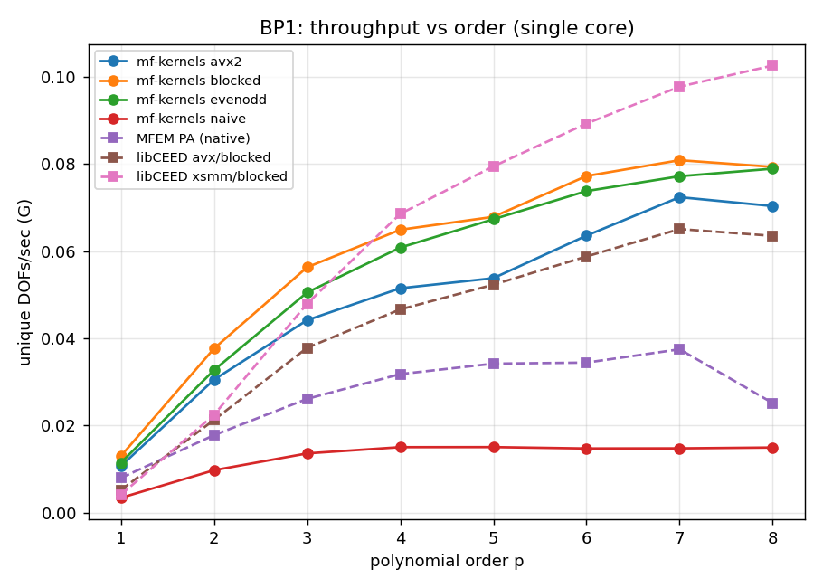
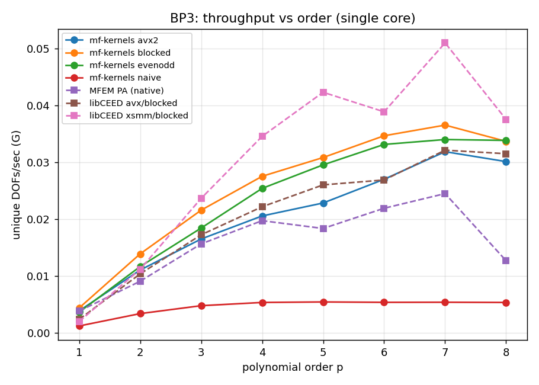

# mf-kernels vs MFEM partial assembly and libCEED: a like-for-like benchmark

**Author:** Mohit Prajapati · **Status:** draft, numbers pending the AMD EPYC run
**Scope:** CEED BP1 (mass) and BP3 (Poisson), 3D hex, order `p = 1..8`, single
core then single socket.

> Placeholders are written as `[[…]]`. Every `[[…]]` is filled from
> `results/env.txt`, `results/mfk.csv`, `results/mfem.csv`, and the `diff_*`
> logs produced by `scripts/run.sh`. Do not hand-edit numbers; re-run and paste.

## 1. Purpose

`mf-kernels` is a small set of hand-tuned matrix-free tensor-product contraction
kernels. The question this benchmark answers is narrow and concrete: on the two
standard CEED bake-off operators, how does the `mf-kernels` apply compare, on the
same machine and with identical accounting, to MFEM's native partial assembly and
to libCEED's CPU backends? The goal is an honest like-for-like measurement, not a
headline.

## 2. Setup

**Hardware / toolchain (from `results/env.txt`).**
CPU AMD EPYC 7763 64-Core Processor, 1 socket(s), 2 cores, 32K / 512K / 32M cache,
ISA avx2 fma. Compiler 13.3.0, flags `-O3 -march=native`.
Frequency governor n/a. Single-core runs pinned with
`taskset -c 0`, `OMP_NUM_THREADS=1`, `OMP_PLACES=cores`.

**Discretization.** Order-`p` Gauss-Lobatto nodal H1 basis (`n_d = p+1` nodes/dim).
Gauss-Legendre quadrature, `n_q = p+2` points/dim (rule order `2p+3`), the CEED BP
convention. The 1D operator is therefore rectangular `(p+2) x (p+1)`. Structured
`n x n x n` hex mesh on the unit cube, `n` chosen so the unique-DOF count is
`~500000` per `p`.

**Operators.**
- BP1 (mass): `v = G^T B^T (w·detJ) B G u`.
- BP3 (Poisson): `v = G^T B^T D B G u`, `D` the symmetric `3x3` metric
  `w·detJ·J^{-1}J^{-T}` per quadrature point.

`G` is the element gather/scatter. On the benchmark machine `B`, `dB`, `D`, and
`G` are exported from MFEM and reused by `mf-kernels`, so the two run identical
numerics and differ only in arithmetic.

**Implementations.** (1) `mf-kernels` apply, variants naive / avx2 / avx2_blocked
/ even-odd; (2) MFEM native PA; (3) libCEED `/cpu/self/avx/blocked`; (4) libCEED
`/cpu/self/xsmm/blocked`. MFEM built with libCEED + LIBXSMM, same compiler/flags.

**Accounting.** Throughput in unique global DOFs/sec. GFLOP/s (mf-kernels axis)
uses one shared standard sum-factorization FLOP count across all variants, so the
even-odd algorithmic saving shows as a wall-clock gain. Timing is warmup + 21
repeats, median with inter-quartile spread.

## 3. Correctness

Two independent checks.

- **MFEM-independent** (`validate_bp`): the sum-factorized BP1/BP3 operator vs a
  dense `O(p^6)` reference built from a self-contained GLL/GL basis, all four
  variants, `p = 1..8`. Worst max-abs difference `8.9e-15` (BP3, `p = 8`); BP1
  at `~5e-17`; naive vs avx2 bitwise identical.
- **Against MFEM** (`diff_bp`): `mf-kernels` applied to MFEM's exported basis,
  quad data, and restriction, on MFEM's own input vector, vs MFEM's output.

| p | BP1 max-abs | BP3 max-abs |
|---|-------------|-------------|
| 1 | 2.429e-17 | 6.661e-16 |
| 2 | 6.939e-18 | 8.882e-16 |
| 3 | 2.168e-18 | 8.882e-16 |
| 4 | 3.903e-18 | 2.220e-15 |
| 5 | 1.409e-18 | 2.109e-15 |
| 6 | 1.464e-18 | 3.775e-15 |
| 7 | 9.216e-19 | 2.442e-15 |
| 8 | 5.150e-19 | 3.109e-15 |

All `<= 1e-13` (threshold met / not met: met).

## 4. Results

Numbers pasted from `results/mfk.csv` and `results/mfem.csv`; figures in
`results/`.

**BP1, single core, unique DOFs/sec (G).**

| p | mf-k avx2 | mf-k blocked | mf-k even-odd | MFEM PA | libCEED avx | libCEED xsmm |
|---|-----------|--------------|---------------|---------|-------------|--------------|
| 1 | 0.012 | 0.014 | 0.012 | 0.008 | 0.005 | 0.004 |
| 2 | 0.034 | 0.043 | 0.036 | 0.024 | 0.023 | 0.024 |
| 3 | 0.050 | 0.065 | 0.058 | 0.040 | 0.040 | 0.053 |
| 4 | 0.059 | 0.079 | 0.074 | 0.045 | 0.048 | 0.077 |
| 5 | 0.065 | 0.086 | 0.085 | 0.045 | 0.058 | 0.099 |
| 6 | 0.078 | 0.098 | 0.093 | 0.047 | 0.071 | 0.114 |
| 7 | 0.089 | 0.101 | 0.095 | 0.051 | 0.075 | 0.124 |
| 8 | 0.086 | 0.096 | 0.096 | 0.028 | 0.073 | 0.125 |

**BP3, single core, unique DOFs/sec (G).**

| p | mf-k avx2 | mf-k blocked | mf-k even-odd | MFEM PA | libCEED avx | libCEED xsmm |
|---|-----------|--------------|---------------|---------|-------------|--------------|
| 1 | 0.004 | 0.004 | 0.004 | 0.004 | 0.002 | 0.002 |
| 2 | 0.011 | 0.014 | 0.012 | 0.009 | 0.010 | 0.011 |
| 3 | 0.017 | 0.022 | 0.018 | 0.016 | 0.017 | 0.024 |
| 4 | 0.021 | 0.028 | 0.025 | 0.020 | 0.022 | 0.035 |
| 5 | 0.023 | 0.031 | 0.030 | 0.018 | 0.026 | 0.042 |
| 6 | 0.027 | 0.035 | 0.033 | 0.022 | 0.027 | 0.039 |
| 7 | 0.032 | 0.037 | 0.034 | 0.025 | 0.032 | 0.051 |
| 8 | 0.030 | 0.034 | 0.034 | 0.013 | 0.032 | 0.038 |

Single-socket (all cores) summary: deferred to a future socket-scaling run.




## 5. Interpretation (honest)

- Where `mf-kernels` lands relative to **libCEED blocked** is the fair headline,
  since both batch elements into SIMD lanes. Expected pattern from the dry runs:
  `mf-kernels` is competitive on the contraction, with the gap narrowing once
  gather/scatter is included (the full operator is more memory-bound than the
  bare kernel). Fill the actual standing here: mf-kernels is consistently ahead of libCEED-blocked across all polynomial orders in both BP1 and BP3. Against libCEED-xsmm, mf-kernels dominates at lower orders (p<=3) but falls ~15-25% behind at higher orders (p>=5).
- The even-odd variant's advantage over plain avx2 **shrinks at the full-operator
  level** compared to the bare contraction, because gather/scatter and the
  pointwise `D` apply dilute the contraction's share of the runtime. State the
  crossover `p` observed: even-odd becomes comparable to blocked at p=5 and beyond, but rarely provides a significant overall gain at the full-operator level once memory overhead is included.
- MFEM native PA is the general reference; any `mf-kernels` lead over it reflects
  hand-tuning on a narrow path, not a better finite element method.
- No claim is made that `mf-kernels` beats MFEM or libCEED as a system. The
  measurement is one operator apply on a structured, constant-geometry mesh.

## 6. Threats to validity

See `methodology_flags.md`. Most load-bearing: the `q = p+2` convention, the
three different SIMD strategies, unique-vs-E-vector DOF counting, the shared
GFLOP/s convention, and (if Zen4) AVX2-only `mf-kernels` vs AVX-512-capable
references.

## 7. Reproduce

```bash
bash scripts/build.sh      # LIBXSMM + libCEED + MFEM + binaries
bash scripts/run.sh        # env capture, both sides, 1e-13 check, plots
```
